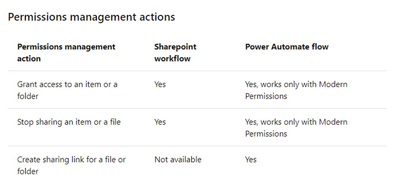
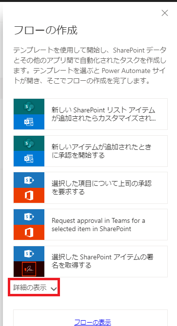
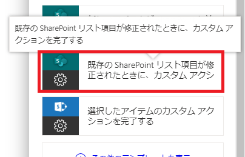
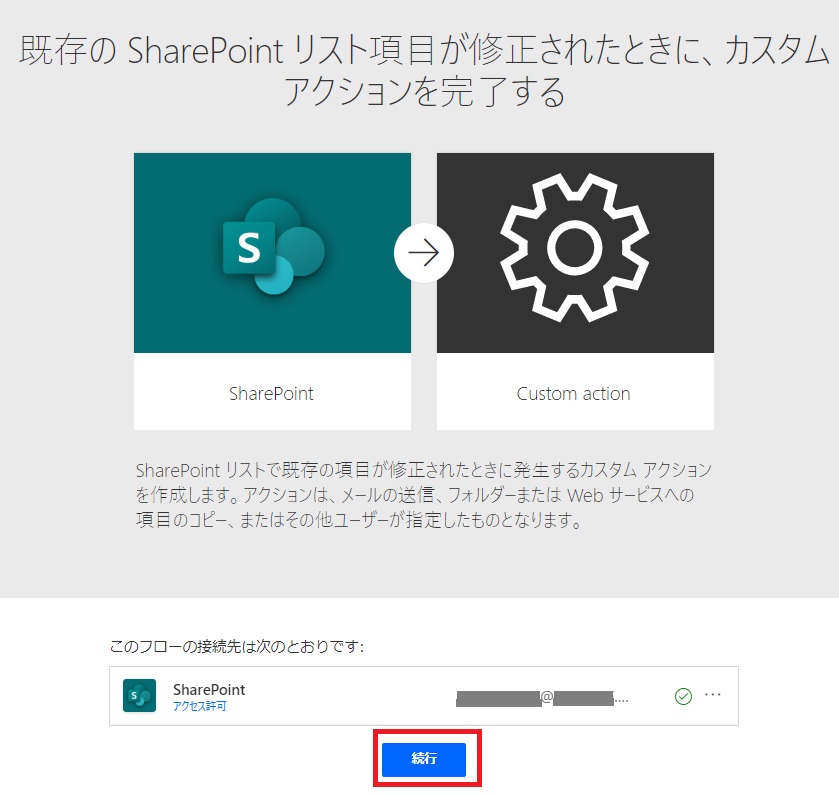
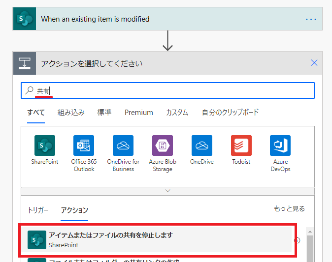
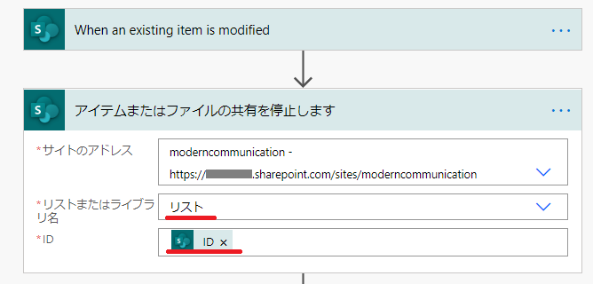
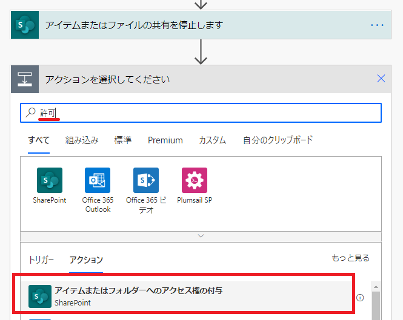
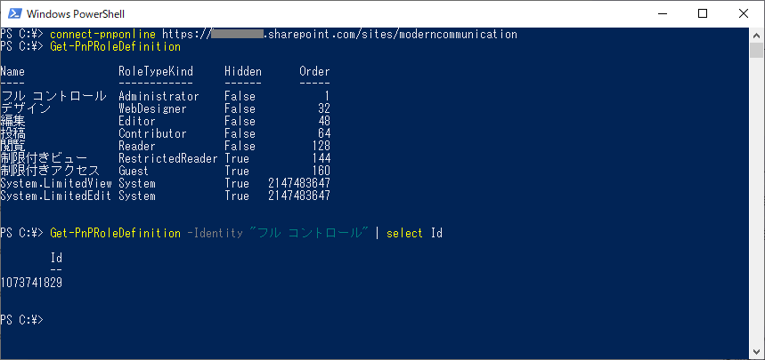
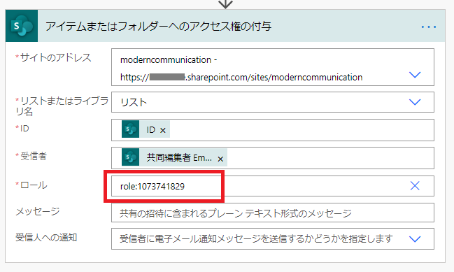

# Power Automate で　SharePoint リスト　アイテムに対して個別のアクセス権を付与する方法

今回の投稿では、SharePoint Online における [SharePoint 2010 形式ワークフローの廃止](https://support.microsoft.com/ja-jp/office/1ca3fff8-9985-410a-85aa-8120f626965f?ui=ja-jp&rs=ja-jp&ad=jp) (MC217999) に際して、移行先となる Power Automate を簡単に紹介します。

移行プロジェクトにおいて、最も技術的な懸案事項に指定されているものに、個別アクセス権の付与が数多く上げられております。アイテムごとにアクセス権を付与する運用は、パフォーマンスを考慮した場合は得策ではありません。しかしながら、多くのユーザーが SharePoint 2010 形式ワークフローを利用する一つの根強い理由として挙げられているため、ここに Power Automate による回避策を記載します。

なお、前提として [SharePoint の制限](https://docs.microsoft.com/ja-jp/office365/servicedescriptions/sharepoint-online-service-description/sharepoint-online-limits) には、リストまたはライブラリ内のアイテムに対する固有の権限は 5,000 までと指定されております。そのため、固有のアクセス権を割り当てる運用を実施する場合、リストまたはライブラリ内のアイテムが 5,000 を超えないようキャパシティ プランをお願いします。

## 公開情報より

公開情報には、アイテムまたはフォルダーへのアクセスを許可する、中止するといったアクションに対して、条件付きで可能との記載があります。

タイトル : Guidance: Migrate from classic workflows to Power Automate flows in SharePoint
アドレス : https://docs.microsoft.com/en-us/sharepoint/dev/business-apps/power-automate/guidance/migrate-from-classic-workflows-to-power-automate-flows

モダン UI のアクセス許可もクラシックのアクセス許可に影響するので、特に大きな問題はありません。以下のように落ち着いてソリューションを実施しましょう。

## ウォークスルー
### 1. まずは、モダン UI のリストやライブラリから、[自動化] – [Power Automate] – [フローの作成] よりフローを作成していきます。

### 2. フローの作成ペインにて、[詳細の表示] – [既存の SharePoint リスト項目が修正されたときに、カスタム アクションを完了する] をクリックします。

### 3. [続行] をクリックします。

画像ではマスクしていますが、ここに表示されるユーザーの権限で処理が実行されます。
サイト コレクションの管理者権限等、十分なアクセス権をフローの作成者に与えてください。

### 4. フローの編集画面に遷移しました。[+ 新しいステップ] をクリックして後続の処理を追加していきます。

### 5. 親のアクセス権を継承しない場合は、[アイテムまたはファイルの共有を停止します] を選択します。

### 6. “リストまたはライブラリ” と “ID” に動的なコンテンツ (値) を設定します。

### 7. 実際にアクセス権を適用していきます。アクション選択画面で [アイテムまたはフォルダーへのアクセス権の付与] をクリックします。

### 8. 受信者にはアクセス権を与えるユーザーを指定し、ロールには権限レベルを指定します。

この例では、リストに追加されたユーザー列である、”共同編集者” を動的なコンテンツ (値) から指定しています。
ロールとしては、Can edit と Can view のいずれかをプルダウンから選択します。

これで、最低限アクセス許可を与えるフローの作成は完成です。

## 編集や閲覧以外のアクセス許可を付与する方法

アクション側の入力項目において、ロールには Can edit と Can View が 2 択で表示されますが、[カスタム値の入力] をクリックして、他のアクセス権 (ロール) を付与することは可能であることを確認しています。

この部分のみ、少し複雑な手順となりますが、併せて以下に記載します。

### 1. 必要とするロール定義の ID を取得します。

以下の a か b のいずれかの方法をご利用ください。

#### a. PowerShell を使用する場合
a-1. PnP PowerShell をお持ちでない場合は[入手](https://docs.microsoft.com/ja-jp/powershell/sharepoint/sharepoint-pnp/sharepoint-pnp-cmdlets?view=sharepoint-ps)します。
a-2. Connect-PnPOnline <サイト URL> を実行します。
a-3. Get-PnPRoleDefinition を実行して、サイトに存在するロールの定義を一覧表示します。
a-4. Get-PnPRoleDefinition -Identity <ロール名> | select Id を実行して Id を抜き出します。

以下の例では、フルコントロールの Id として 1073741829 を取得します。

#### b. REST を使用する場合
b-1. ブラウザーで SharePoint のページを表示します。
b-2. サイト URL 配下を以下のように変更します。
https://tenant.sharepoint.com/sites/site/_api/web/roledefinitions
b-3. XML でロール名が表示されるので、ロール名に対応する Id を取得します。

以下の例では “フル コントロール” の ID として 1073741829 を取得します。

IE などのブラウザーでは、フィード画面が表示される場合があります。その場合、[Alt] キーを押し、[ファイル] - [名前を付けて保存] をクリックして結果をローカル ファイルに保存すると、ブラウザー側に返されている XML のデータが保存されます。

### 2. "アイテムまたはフォルダーへのアクセス権の付与" のアクションにて、role:ID 値 を文字列で指定します。

## 実行結果

リストにアイテムを投稿すると、共同編集者列のユーザーにアクセス許可が付与される動作を確認できます。

